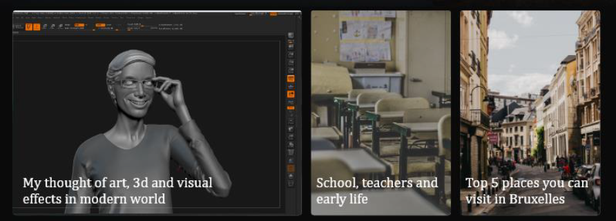

# Blog website for university practice 

**Technologies used:**
- JS/HTML/CSS
- JAMStack architecture, which relies on JavaScript, reusable APIs, and Markup
- Gatsby - a static site generator from React + GraphQL applications
- Contentful - content management system on static pages
- Netlify - deployment system

> You can view website here -> https://mykytamorar.netlify.com/

**Operating procedure:**
- Phase 1: Designing Homepage Cards & Card Grid Layout
- Phase 2: Designing Footer & Blog Archive Page
- Phase 3: Designing Individual Blog Page Template
- Phase 4: Designing Contact Page
- Phase 5: Creating Content Models in Contentful
- Phase 6: Adding Media & Content in Contentful
- Phase 7: Installing Plugins for Gatsby
- Phase 8: Building the Nav Component
- Phase 9: Styling the Nav Component
- Phase 10: Building the Featured Component
- Phase 11: Styling the Featured Component
- Phase 12: Building the Homepage Cards & Card Grid Layout
- Phase 13: Styling the Homepage Cards & Card Grid Layout
- Phase 14: Building & Styling the Footer
- Phase 15: Creating the Blogs with the Create Page API
- Phase 16: Building the Blog Template
- Phase 17: Styling the Blog Template
- Phase 18: Creating the Blog Archive & Add Pagination
- Phase 19: Building the Blog Archive Template
- Phase 20: Styling the Blog Archive
- Phase 21: Building the Contact Page using Netlify Forms
- Phase 22: Styling the Contact Page
- Phase 23: Deploying the Site to Netlify & Setup a Build Webhook

---

**Description of the creation process:**

Firstly, I created a design for my main landing page, it is consisting of the navbar, featured a blog and all other blogs in the cells. In the navbar, there are buttons PZKS and NTUDP, which are links to website of the university and department; Contact button that is heads you to the contact page, where you can write an e-mail to me; Blog button and View More buttons are referring to blog archive, where all the blogs are stored. All of the blog images have a poping effect and all the buttons have a backlight when clicking on them. In the upper left corner, there is a logo button that redirects you to the home page.

After the design process is finished, we can take a closer look at Contentful, which is a tool that I am going to use to make blogs on my website. As soon as Contentful gave permission to use free space I started creating content model, name of the model is Blog and it has thirteen fields, which are: title, featured image, slug, short description, featured, home, content, SEO title, SEO description, SEO image, SEO Author, SEO URL and SEO Keywords.

Then, I started to making blogs (pages) for my website and filling them with images, text and other useful info. Here you can see an example of text filling into blog page:
```css
> Fusce a sagittis dui, a tempor lectus.

Praesent rhoncus eleifend elit, ut vestibulum mi sollicitudin in. Aliquam sed velit in erat posuere semper.
```
Next step is installing software and additional plugins. Software that is used: Git, Node.js, Gatsby. Plugins: Contentful for Gatsby, Google Fonts, Browser Monads.

Now it is time to get into coding. Firstly. I am creating .env.development and .env.production files and writing there CONTENFUL_ACCESS_TOKEN, to pass variable without making it public. Also, in Gatsby-config.js file I require space id, to be able to make a website. I do this because I do not want these tokens to be easily accessed on GitHub.
In the components folder, I create folder nav, which contains two flies, which are index.js and nav.js, where I am writing JS and CSS code for creating navigation bar my page. I am using <Link className{window.location.href}> to create links to different pages on my website.


In the pages folder I have index.js file in which I import components of my website that has to be loaded into page.

Secondly, I create Featured component, namely index.js and featured.css. In index.js I use static queries and graphQL. On the home page there will be home and featured components, and each one would have its own graphQl that it’s calling. So that home page doesn’t actually call any graphQl at all. So, it’s cool way to pass data through project. In the featured query there is allContentfulBlog, which goes straight from the Contentful source plugin. The source plug-in is going to look at all of the blogs that are in Contenful. In the file there is edges called, which I sall the edges or all the blogs. And in each edge is returning a node, I want to get the Id, slig, title, short despription, which are generated from Contentful.


Thirdly, folder `home`, which contains index.js and home.css. `Home` is somehow similar to featured, so there’s just a couple things to change, these are: name of the query, home value and returning HTML for the home page. Also, I am setting on-click function which navigates you into blog specifically.



And for the finishing touch of the components folder I create footer, which contains footer.css and index.js, in these files I am just inserting footer image and making View More button.

Now it’s time to make blog pages. So, in order to create each individual page programmatically for the blog I need to use the create page Gatsby API and I do that in Gatsby-node.js file. Here I am making a request and calling to Contentful for some data, and the data that I need each blog’s slug and id. Then competent will look for the template that I will create and it’s going to build individual blog page of that template. Code that I have in blog.js. will create a template for each blog, in the Blog query I call for all the fields that I created in Contentful. It will pass some fields into layout also. All the css files were created for these pages too.


Then, in Gatsby-node.js I created pagination code, which is an array, that created pages with forEach statement, is takes the template form blog.js file. Next thing is archive template, archive is the place where all the blogs is stored, because home page takes only 9 pages. Archive code structure I similar to blog.js and featured.js files, it also takes data from Contentful, has pagination. Last thing to code is contact form, which is connected to Netlify, and what is interesting form submitting here is created without having to use js. And then I push all of files to GitHub and connecting that to Netlify and now you can find my landing page website at mykytamorar.netlify.com.
